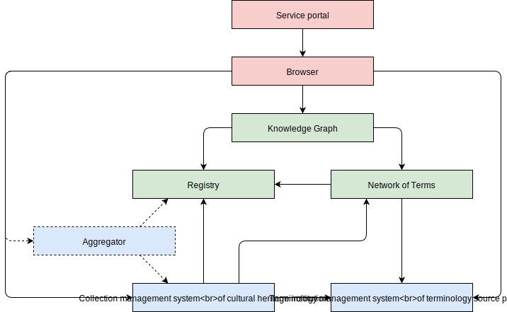

# Building blocks
The distributed network of heritage information consists of building blocks. A building block, according to The Open Group Architecture Framework (TOGAF), is a package of functionality defined to meet business needs with published interfaces to access the functionality[1](#fn1). There are eight building blocks, divided into three groups or layers: _back end building blocks_, _cross-domain building blocks_ and _front end building blocks_. The diagram underneath depicts the blocks:

## Contents
- [Back end building blocks](#back-end-building-blocks)
    - [Terminology management system](#terminology-management-system)
    - [Collection management system](#collection-management-system)
    - [Aggregator](#aggregator)
- [Cross-domain building blocks](#cross-domain-building-blocks)
    - [Registry](#registry)
    - [Network of Terms](#network-of-terms)
    - [Knowledge Graph](#knowledge-graph)
- [Front end building blocks](#front-end-building-blocks)
    - [Browser](#browser)
    - [Service portal](#service-portal)

## Back end building blocks

### Terminology management system
A terminology management system manages and publishes the term descriptions of a terminology source. It is used by a terminology source maintainer for describing terms in the source, for example by assigning labels or scope notes.

A terminology management system is either purpose-built or generic. Purpose-built systems include [RKDartists&](https://rkd.nl/en/explore/artists) and the [shared automated cataloging system](https://www.oclc.org/en/ggc-stub.html) of the Dutch libraries (GGC). Generic systems include [OpenSKOS](http://openskos.beeldengeluid.nl/) and [PoolParty](https://www.poolparty.biz/), systems that can be used for all sorts of terminology sources, such as the [Common Thesaurus for Audiovisual Archives](http://gtaa.beeldengeluid.nl/) (GTAA) and the [Erfgoedthesaurus](http://www.erfgoedthesaurus.nl/).

A terminology management system can contain different types of terminology sources. For example: a terminology source can be national (such as RKDartists&) or international (such as [DBpedia](http://wiki.dbpedia.org/)). Another example: a terminology source can be self-contained (such as the [Art & Architecture Thesaurus](http://website.aat-ned.nl/) (AAT)) or an adaptation, extension or fusion of one or more sources (such as the Visual Thesaurus for Fashion and Costumes (VTMK)).

A terminology management system is compliant with the distributed network if it can publish its term descriptions as Linked Open Data in a standardized term vocabulary, such as [SKOS](https://www.w3.org/TR/skos-primer/).

### Collection management system
A collection management system — or _collection registration system_ — manages and publishes the object descriptions of a cultural heritage institution. It is used by a collection manager, such as a cataloger, curator or librarian, for describing objects in the collection of the institution, for example by assigning terms from terminology sources.

A collection management system is compliant with the distributed network if it meets three conditions. First, it can assist a collection manager in finding appropriate terms for describing objects by querying the Network of Terms and storing the matching identifiers as part of the object descriptions. Second, it can publish its object descriptions as Linked Open Data in a domain-specific or domain-independent vocabulary, such as [Encoded Archival Description](https://www.loc.gov/ead/) (EAD), [Europeana Data Model](http://pro.europeana.eu/page/edm-documentation) (EDM) or [Schema.org](http://schema.org/). Third, it can register organization, dataset and object profiles in the Registry.

A cultural heritage institution can use an aggregator if its collection management system is yet unable to publish Linked Data or register profiles on its own.

### Aggregator
An aggregator — or _harvester_ — gathers together the metadata of objects from a number of providers into a combined data store. A user can then query the aggregator unequivocally, independent of how the providers had originally delivered their data. An aggregator typically uses a protocol such as [OAI Protocol for Metadata Harvesting](https://www.openarchives.org/pmh/) (OAI-PMH).

An aggregator collects specific types of information from designated institutions. For example: the regional aggregator [Collectie Gelderland](http://www.collectiegelderland.nl/) collects information from institutions in its province, whereas the national aggregator [Digitale Collectie](http://digitalecollectie.nl/) collects information from institutions all over the country. Another example: the thematic aggregator [Netwerk Oorlogsbronnen](http://www.netwerkoorlogsbronnen.nl/) collects information related to World War II from a variety of institutions, whereas the domain aggregator [Archives Portal Europe](https://www.archivesportaleurope.net/) (APE) collects information from solely archival institutions.

An aggregator is compliant with the distributed network if it meets two conditions. First, it can publish its object descriptions as Linked Open Data in a domain-specific or domain-independent vocabulary. Second, it can register object profiles of its providers in the Registry.

The role of an aggregator in the distributed network of heritage information will change in time, depending on the capabilities of the collection management systems of cultural heritage institutions. First, an aggregator is necessary for institutions whose collection management systems cannot publish their object descriptions as Linked Data. An aggregator does this for them. Second, an aggregator is necessary for institutions whose collection management systems can publish Linked Data, but have limited possibilities in doing so, for example when exporting or querying object descriptions. A specific Linked Data aggregator — also known as a _Linked Data platform_ or _Linked Data wrapper_ — assists in exposing Linked Data. Third, an aggregator is no longer needed for institutions whose collection management systems can offer their object descriptions as full-grown Linked Data. An aggregator may then become a _browser_ or _service portal_.

## Cross-domain building blocks

### Registry
The Registry is a cross-domain building block for registering profiles. It contains three types: organization profiles, dataset profiles and object profiles. These profiles are registered in the Registry by their maintainers, notably cultural heritage institutions. The profiles as a whole show which organizations, datasets and objects constitute the distributed network of heritage information.

A profile principally consists of identifiers or URIs. Identifiers point to the places where information about organizations, datasets and objects can be found. The goal of a profile is to facilitate discovery: its identifiers are starting points that enable users of the Registry to find relevant heritage information.

Each institution decides for itself which profiles it wants to register in the Registry. The Registry does not impose conditions on the content, type or purpose of the contributions by institutions. For example: one institution may register multiple dataset profiles in the Registry, one for each dataset, whereas another institution may register one dataset profile of just one dataset.

The Registry can be a distributed service. Rather than having one central service, multiple, autonomous registries can exist for specific purposes. For example: the cultural heritage institutions in the province of Friesland can register their profiles in a _Frisian Registry_ or the archives in the Netherlands can register their profiles in an _Archive Registry_. These registries can then exchange profiles using the infrastructure of the distributed network.

The functions of the Registry are explained in section [Functions](functions.md).

### Network of Terms
The Network of Terms is a cross-domain building block for finding terms. It can for instance be used by collection managers of institutions: they can query the Network of Terms and select terms that describe their objects.

The Network of Terms exposes two types of information. First, the term descriptions of selected terminology sources. For example: [National Thesaurus for Author Names](https://www.kb.nl/bronnen-zoekwijzers/dataservices-en-apis/ggc-thesauri-als-linked-data#toc-5) (NTA) or RKDartists&. Second, the relations between terms, such as synonyms or hypernyms. If a relation exists in a terminology source, the Network of Terms will use it. For example: the NTA refers in its description of [Multatuli](http://data.kb.nl/thesaurus/068243391) to another description — that of the actual author, [Eduard Douwes Dekker](http://data.kb.nl/thesaurus/068934041). If a relation does not exist in a terminology source, the maintainer of the Network of Terms can create it. For example: both the NTA and DBpedia have a description of Multatuli, but there is no relation between these descriptions; the sources do not refer to each other. The maintainer can make this relation explicit by registering it in the Registry; the Network of Terms will then adopt it.

A terminology source can be incorporated in the Network of Terms if it meets a number of conditions. First, it is relevant to the Dutch cultural heritage sector and curated by a Dutch cultural heritage institution. Second, it is standardized and widely used. Third, it is publicly available and easily accessible, without financial, technical or legal constraints. This implies that the Network of Terms does not contain terms of proprietary sources nor of institution-specific sources that aren't used outside of a particular institution. It also implies that the Network of Terms does not contain terms of international sources such as DBpedia, [GeoNames](http://www.geonames.org/) or [VIAF](http://viaf.org/): incorporating such sources would make the Network too heavy. However, the Network can be a _mediator_. This allows users to look for terms in external sources by querying the Network, without having to address the sources directly.

The Network of Terms can be a distributed service. Rather than having one central service, multiple, autonomous networks of terms can exist for specific purposes. For example: the terminology sources used by libraries can be put in a _Network of Terms for Libraries_ and the sources used by museums in a _Network of Terms for Museums_. These networks of terms can then exchange term descriptions using the infrastructure of the distributed network.

The functions of the Network of Terms are explained in section [Functions](functions.md).

### Knowledge Graph
The Knowledge Graph is a cross-domain building block for finding relations between organizations, datasets, objects and terms. The Knowledge Graph gathers these relations by retrieving the profiles from the Registry and extracting the URIs inside the profiles. The Knowledge Graph then relates and stores these URIs. Subsequently other building blocks, such as a browser or service portal, can query the Knowledge Graph and discover relations. For example: a browser can request the Knowledge Graph to find all URIs of datasets or objects that are related to the subject term _Dutch East Indies_ and belong to the organizations Museum Bronbeek and National Archives.

The Network of Terms and Knowledge Graph serve a distinct purpose. Although both building blocks have information about terms, the Network of Terms exposes all terms of terminology sources regardless of the institutions that use the terms, whereas the Knowledge Graph exposes the terms that are actually being used by institutions and the terms that have a direct relation with these terms, such as identical, related, broader or narrower terms.

For example: the Network of Terms may contain the author terms Eduard Douwes Dekker and his pen name _Multatuli_, both stemming from the National Thesaurus for Author Names. An institution that owns a copy of Dekker's book Max Havelaar may use just the term Multatuli in the book's [object description](http://picarta.pica.nl/DB=3.9/XMLPRS=Y/PPN?PPN=09985838X). The Knowledge Graph then knows of Multatuli and also of his orthonym Eduard Douwes Dekker: there is a direct relation between the author terms in the NTA that the Knowledge Graph can use. Another example: the Network of Terms may contain the cities _Eindhoven_ and _Roosendaal_ and their province _Noord-Brabant_, originating from the Erfgoedthesaurus. An institution that maintains a monument in Eindhoven may use that term in its object description. The Knowledge Graph then knows of the city and of its province, a broader term. However, the Knowledge Graph doesn't know of Roosendaal: there is no direct relation between Eindhoven and Roosendaal and no object description referencing Roosendaal.

The Knowledge Graph can be a distributed service. Rather than having one central service, multiple, autonomous knowledge graphs can exist for specific purposes. For example: the relations of libraries can be put in a _Knowledge Graph for Libraries_ and the relations of museums in a _Knowledge Graph for Museums_. These knowledge graphs can then exchange relations using the infrastructure of the distributed network.

The functions of the Knowledge Graph are explained in section [Functions](functions.md).

## Front end building blocks

### Browser
A browser is a building block for discovering heritage information for a service portal. The browser retrieves the terms, relations and profiles from the cross-domain building blocks, notably the Knowledge Graph. The browser then retrieves the associated object and term descriptions from the collection and terminology management systems of the providers. The browser saves the information in its data store, ready for querying by service portals.

A browser provides decoupling: a service portal can use it to get information without having to know and implement the interfaces of the underlying building blocks. A browser also makes it easier to develop new service portals. For example: an organization may use it to build both a website and an app — the foundation is the same.

A browser is different from an aggregator. Although both building blocks collect information, an aggregator generally harvests all available information from providers, without knowing what information is relevant to its users. Instead, the browser collects information selectively, depending on the need of its users, the service portals. This turns harvesting into a directed, service-driven process.

A browser supports a number of protocols for retrieving information from providers, depending on the capabilities of their systems. For example: the collection management system of one institution can be queried periodically via a commonly used protocol such as OAI-PMH whereas the system of another institution can be queried in real-time via a modern protocol such as [Linked Data Fragments](http://linkeddatafragments.org/) (LDF). Eventually the network will evolve into an open and real-time browsable network of distributed heritage information based on LDF and other state of the art protocols.

A basic browser is going to be developed as a cross-domain building block, suitable for common use cases of service portals. A service portal can develop its own browser if it has specific demands.

The functions of the browser are explained in section [Functions](functions.md).

### Service portal
A service portal is a building block that provides a service to users. A service portal uses the cross-domain building blocks of the distributed network, typically by means of a browser.

A service portal can be developed by anyone. For example: cultural heritage institutions, non-profit organizations, governments or businesses. A service portal can be developed for anyone. For example: the general public, exhibition designers, journalists, scientists, students or teachers.

There are two types of service portals. First, a _user interface_. A user interface is operated by an end user for finding and presenting heritage information. For example: a website that can be used by visitors of a museum to browse the collection or an app that can be used by students to explore the paintings of Rembrandt. Second, a _service platform_. A service platform combines and enriches heritage information and makes it usable in a specific context, depending on its goals and users. For example: Digitale Collectie, [Europeana](http://www.europeana.eu/portal/en) or Netwerk Oorlogsbronnen. A service platform may or may not have a user interface where its information is accessible to the public. A service platform without user interface is known as a _dark portal_.

## _References_
* <a name="fn1">1</a>: http://pubs.opengroup.org/architecture/togaf8-doc/arch/chap32.html
